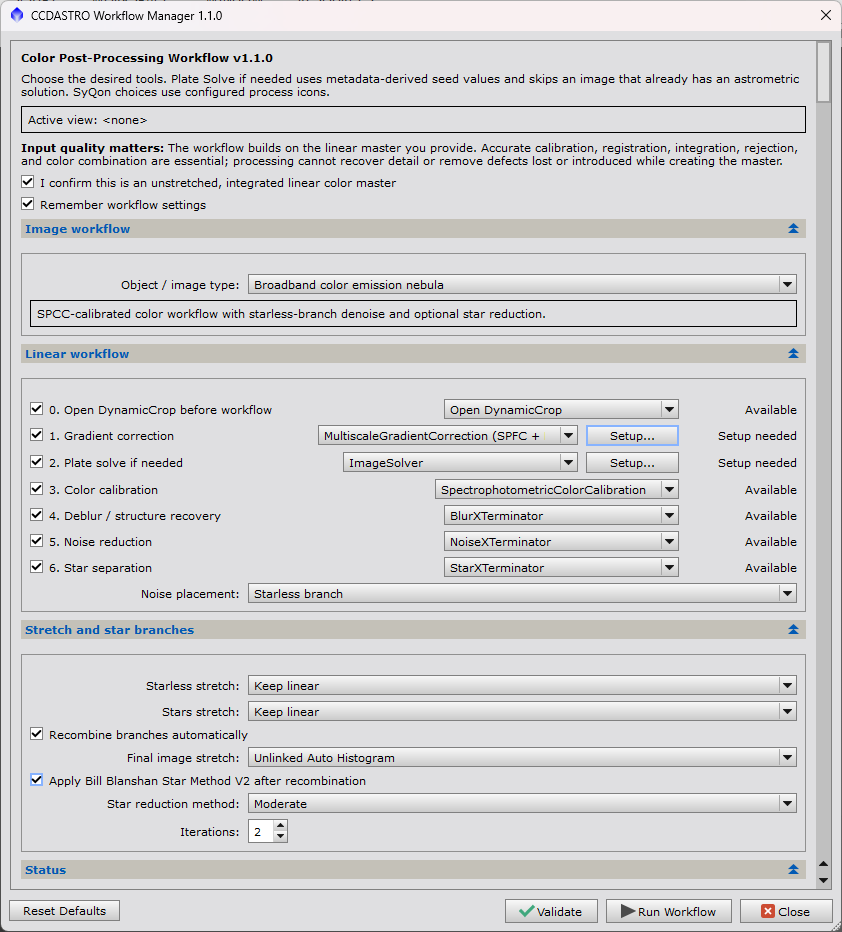

# CCDASTRO PixInsight Workflow Manager v1.1.2

This directory contains a native PixInsight JavaScript Runtime (PJSR) workflow
manager for an integrated linear color master.

## Important: the workflow window hides while processing

> **After you confirm Run Workflow, the Workflow Manager window disappears temporarily. This is normal.**
>
> The window is hidden so it does not cover PixInsight's **Process Console** or
> the processing tools' progress windows. **Follow processing in the Process Console.**
> The workflow is still running; you do not need to reopen or start it again.
>
> **The Workflow Manager window returns automatically after the run finishes or stops with an error.**
> Dismiss any completion or error message to return to the workflow settings.

## Install with PixInsight Update Manager

**Start here — recommended installation. No ZIP download or manual file copying
is needed.** Add the repository below inside PixInsight; its Update Manager
downloads and installs the package for you.

1. In **PixInsight**, choose **Resources > Updates > Manage Repositories**.
2. Click **Add** and paste this entire repository URL, including the final slash:

   ```text
   https://raw.githubusercontent.com/CCDASTRO/PixInsight-Workflow-Manager/main/updates/
   ```

3. Confirm the entry and close Manage Repositories, then choose
   **Resources > Updates > Check for Updates**.
4. Select the CCDASTRO Workflow Manager package and download the update.
5. Exit PixInsight so its updater can install the downloaded package, then restart.
6. Open **Script > CCDASTRO > Workflow Manager**.

**Where does this URL go?** Paste it into PixInsight's **Manage Repositories**,
not your browser's address bar. It is an update repository address, not a
download webpage. Do not substitute the GitHub project page, a Releases page,
or a ZIP-file link.

**Already downloaded a ZIP from GitHub Releases?** You do not need to extract
or run it for the recommended installation. Follow the steps above instead.
The release downloads are not the normal installation route for users.

**Future updates:** keep this repository entry in PixInsight and use
**Check for Updates**. You do not need to download a new ZIP for each release.

If the `CCDASTRO` menu is missing after the first installation, open
**Script > Feature Scripts**, click **Add**, and select PixInsight's installed
`src/scripts` directory. This forces PixInsight to scan and register newly
installed script folders. Restart PixInsight after the scan.

## Workflow Manager interface

Select the processing steps with the checkboxes, choose the desired tool for
each step, and click **Run Workflow**. The manager runs the selected steps in
the required order.

**During the run, this settings window is hidden to keep the Process Console
visible. It returns automatically when the run ends.**



## [short video](https://youtu.be/0G-PI8F51rE)

## Revision history

- **v1.1.2:** Adds PixInsight 1.9.5 release compatibility, strict package-content checks,
  and documented passing astrometry, SPFC/MGC, and SPCC runtime tests.
  RC Astro integration testing remains pending; its modules were unavailable.

- **v1.1.1:** Fixes recursive SyQon script execution while preserving configured
  process-icon settings. Runs processing outside the workflow setup dialog so
  the Process Console remains accessible. Documents the manual Starless step:
  click **Generate Starless**, monitor the **Process Console** for completion,
  then close the Starless window so the workflow can import the result and continue.
- **v1.1.0:** Adds MGC as an optional gradient method, with automatic prerequisite
  plate solving and configured SPFC/MGC process icons, setup guidance, and preflight checks.
- **v1.0.0:** First stable public release. Promotes the fully tested,
  profile-driven color-master workflow, executable adapters, preflight checks,
  branch processing, recombination, and Update Manager distribution.
- **v0.6.3:** Prevents section toggles from shrinking the dialog and raises the
  adaptive minimum height while retaining scrolling on smaller displays.
- **v0.6.2:** Makes the dialog resizable and adds collapsible, vertically
  scrollable workflow sections for smaller displays and high display scaling.
- **v0.6.1:** Adds prominent guidance about linear-master quality and documents
  that users may choose their preferred calibration and integration method.
- **v0.6.0:** Adds object/image-type profiles with tailored workflows for color
  masters, emission nebulae, mapped narrowband images, galaxies, and star clusters.

## Capabilities

- An **Object / image type** dropdown that presents only the recommended stages
  for General Color Image, Broadband Color Emission Nebula, Mapped Narrowband
  Color Emission Nebula, Galaxy, Star Cluster, or Custom Workflow.
- Profile-specific defaults while accepting any integrated linear color master,
  regardless of whether it originated with a one-shot-color or mono camera.
- Direct final-image stretching for profiles such as Star Cluster that do not
  use star separation and recombination.
- Interactive DynamicCrop handoff and preflight detection of likely
  integration borders.
- Persistent last-used workflow selections with a Reset to Defaults control.
- Safe cancellation from the PixInsight Process Console between workflow stages.
- Ordered checkboxes for gradient correction, SPCC, deblur, denoise, and star
  separation.
- Optional **Plate Solve if needed** step before SPCC, with a dedicated setup
  dialog and automatic seed-value extraction from FITS/XISF metadata (approximate information ImageSolver needs to begin matching the image against a star catalog).
- GradientCorrection, GraXpert, or MultiscaleGradientCorrection with SPFC.
- BlurXTerminator or SyQon Parallax.
- NoiseXTerminator, MLDenoise (installed process defaults), or SyQon Prism/DeepPrism.
  MLDenoise requires the process to be installed and available to scripts. It uses
  the same full-image or starless-branch placement as the other noise tools.
  The workflow reports it as unavailable if the process is missing.
- StarXTerminator, StarNet2, or SyQon Starless.
- Automatic `<target>_stars` naming for the retained stars-only branch.
- Main denoise placement before star separation or on the starless branch.
- Recommended linear starless and stars branches, followed by linear-add
  recombination and one conservative linked automatic histogram stretch.
- Independent branch stretches remain available as advanced alternatives,
  but cannot be combined with the final recombined stretch.
- Optional Bill Blanshan Star Method V2 PixelMath reduction after branch
  recombination, with Strong, Moderate, or Soft modes and 1–3 iterations.
- Linear-add or nonlinear screen-blend PixelMath recombination.
- Preflight validation for input state, astrometry, installed process classes,
  configured SyQon icons, and branch dependencies.
- Version 3 profile-aware workflow schema with `main`, `starless`, and `stars` lanes.
- Contextual mouse-over help for processing choices and branch controls.
- Certified PixInsight code-signing support for trusted Update Manager packages.

## Select an object or image type

Select the profile before choosing individual tools. Changing the profile loads
its recommended settings and hides stages that do not apply. These are starting
points: every displayed stage can still be enabled, disabled, or configured.

| Profile | Presented workflow |
| --- | --- |
| General color image | Complete configurable workflow |
| Broadband color emission nebula | SPCC, star separation, starless denoise, recombination, stretch, and optional star reduction |
| Mapped narrowband color emission nebula | Gradient, deblur, star separation, starless denoise, recombination, and stretch; broadband SPCC is omitted |
| Galaxy | SPCC, structure recovery, starless denoise, recombination, and a restrained stretch |
| Star cluster | SPCC, conservative full-image deblur and denoise, and direct full-image stretch without star separation |
| Custom workflow | All available stages using the current selections |

The mapped narrowband profile expects an already combined mapped-color master.
It does not perform HOO or other palette construction. Use the General or Custom
profile when the image needs different color treatment.

The default General Color Image order is:

1. Optional interactive DynamicCrop handoff
2. GradientCorrection or GraXpert
3. ImageSolver when the image does not already have an astrometric solution
4. SpectrophotometricColorCalibration (SPCC)
5. BlurXTerminator or SyQon Parallax
6. StarXTerminator, StarNet2, or SyQon Starless
7. NoiseXTerminator, MLDenoise, or SyQon Prism on the starless branch
8. Linear-add PixelMath recombination
9. One linked automatic histogram stretch on the recombined image

## MultiscaleGradientCorrection (MGC)

Version 1.1.0 adds **MultiscaleGradientCorrection (SPFC + MGC)** to the
Gradient correction dropdown. GradientCorrection remains the default; GraXpert
is still available. MGC is an alternative, not a guaranteed improvement on every
image, and does not replace SPCC color calibration.

When MGC is enabled, the order is **Plate Solve if needed → SPFC → MGC → SPCC**
(if SPCC is enabled), followed by the selected deblur and branch-processing
stages. The prerequisite solve runs even when the separate plate-solve checkbox
is off, and is skipped if valid astrometry already exists. SPFC runs afresh on
the current linear master; there is no automatic fallback to another gradient tool.

### MGC setup

1. Open **SpectrophotometricFluxCalibration**. Select the appropriate camera/QE
   and filter transmission settings and configure its Gaia spectrophotometric
   catalog. Drag a configured process instance to the workspace and rename it
   exactly `CCDASTRO_SPFC`.
2. Open **MultiscaleGradientCorrection**. **Set up the MARS database file
   locations before creating or saving the process icon.** Add your installed
   MARS database files, choose suitable reference filters, and configure the
   gradient settings. Use MARS database mode, not a reference-image or
   database-management command. Only then drag the configured process's
   **New Instance** triangle onto the workspace and rename the icon exactly
   `CCDASTRO_MGC`. This captures the MARS locations and other process settings
   for the workflow to reuse.
3. Test both native processes on a copy of the solved, linear master. Confirm
   the target lies within usable MARS coverage and that its preprocessing
   metadata and filter information meet SPFC requirements.
4. Select MGC in the manager. Click the gradient row's **Setup...** button for
   guidance and plate-solving seed values, then run **Validate**.
5. Keep both icons loaded in the workspace. Save them as a process-icon file
   for reuse; the manager remembers the choice, not the icons themselves.

**Already created the MGC icon, or moved the MARS files?** Open the saved
`CCDASTRO_MGC` instance, correct its database locations, then update or replace
that workspace icon and save your process-icon file again. Changing settings
in a separate MGC instance does not update the existing saved icon. Reload the
saved icon and confirm its MARS locations before running the workflow.

Preflight checks the installed processes, exact icon names/types, MARS mode,
and astrometry or solver setup. It cannot certify catalog contents, sky coverage,
filter suitability, or preprocessing provenance: the native processes perform
those checks at execution. Errors stop the workflow; they do not trigger a
second correction on a partially processed image. Inspect the Process Console
and restart from an appropriate saved master when retrying.

The mapped narrowband color profile blocks MGC because arbitrary palette
combinations do not necessarily correspond to physical MARS passbands. Use
GradientCorrection or GraXpert there. Selecting Custom does not make a mapped
image physically suitable for MGC.

**MGC says Setup needed:** confirm both icons above are loaded and contain the
correct native processes. If the image is unsolved, review the gradient
**Setup...** dialog for coordinates and image scale.


## Configure optional cropping

The validator warns when it detects high-confidence zero or nonfinite pixels
along the image borders. Crop integration and registration borders before
GradientCorrection.

To crop the current image, enable **Open DynamicCrop before workflow** and click
**Run Workflow**. The workflow applies a display-only linked AutoSTF, closes,
and opens DynamicCrop. Draw and apply the crop, then launch the workflow again
and run **Validate** before processing. AutoSTF does not alter the linear pixels.

With **Remember workflow settings** enabled, the workflow restores enabled
steps, selected tools, denoise placement, stretch choices, and recombination
after the crop handoff or a normal restart. The crop option is restored off and
the linear-image safety confirmation must always be selected again. Click
**Reset Defaults** to clear the saved state.

Deblur runs before the main denoise pass. Gradient correction precedes SPCC,
and SPCC requires a plate-solved image.

## Requirements

- PixInsight 1.9.4, including the standard ImageSolver script. PixInsight 1.9.5
  release preparation is documented in [the compatibility checklist](docs/PIXINSIGHT-1.9.5.md);
  astrometry, SPFC/MGC, and SPCC passed tests on 1.9.5 build 1702;
  full workflow and third-party module verification remain pending.
- An integrated, unstretched color master, preferably 32-bit floating-point
  XISF.
- For SPCC, either an existing astrometric solution or approximate coordinates
  and image-scale metadata for the Plate Solve adapter.
- The selected third-party processes, applications, models, and licenses.

### Linear-master quality

The workflow starts with the integrated linear color master you provide and is
independent of the calibration and integration method used to create it. Use
WBPP, another preprocessing script, process icons, or a manual process according
to your needs.

The quality of that master sets the limit for the workflow's results. Accurate
calibration, registration, integration, pixel rejection, and color combination
are essential. Inspect the master for gradients, clipping, registration errors,
satellite trails, residual hot pixels, walking noise, and integration borders
before continuing. Later processing can enhance good data, but it cannot recover
detail or reliably remove defects lost or introduced during preprocessing.

The preflight validator reports unavailable process classes and missing SyQon
process icons before execution.

## Configure Plate Solve if needed

The workflow enables **Plate Solve if needed** by default. When the active image
already has an astrometric solution, the adapter preserves it and continues to
SPCC without solving again.

For an unsolved image, the manager initializes PixInsight ImageSolver and reads
the approximate center coordinates, focal length, pixel size, and image
resolution from available FITS/XISF metadata. The status shows **Ready** when
the metadata contains enough information.

If the status shows **Setup needed**:

1. Select the integrated linear master as the active image.
2. Click **Setup...** beside **Plate Solve if needed**.
3. Click **Autofill from Active Image**.
4. Review or enter RA and Dec in degrees.
5. Provide either image resolution in degrees per pixel, or both focal length
   in millimeters and effective pixel size in micrometers.
6. Click **Save Setup**, then **Validate**.

The adapter uses ImageSolver's automatic catalog and magnitude selection. It
must create a valid astrometric solution before SPCC can run. Approximate
coordinates must be reasonably close to the image center; the setup dialog is
not a blind-solve service.

## Install manually as a Feature Script (advanced alternative)

Most users should use **Install with PixInsight Update Manager** at the top of
this page. Manual installation is an alternative, not an additional required step.

1. Download or clone this repository.
2. Locate PixInsight's installed `src/scripts` directory.
3. Create `src/scripts/CCDASTRO` and copy `CCDASTROWorkflowManager.js` into it.
   This sibling location is required because the workflow uses PixInsight's installed
   `src/scripts/ImageSolver` library.
4. Start PixInsight and choose **Script > Feature Scripts**.
5. Click **Add** and select the new `src/scripts/CCDASTRO` directory.
6. Enable recursive search if available and allow the feature scan to finish.
7. Open **Script > CCDASTRO > Workflow Manager**.

The GitHub `tree/main/pixinsight` webpage is not an update URL. Use the raw
`updates/` URL above for Update Manager or use the installed scripts directory
for a manual Feature Scripts installation.

## Configure SyQon choices

SyQon's PixInsight integrations are instantiable scripts that manage external
applications, model files, licenses, temporary files, and output import. The
workflow manager reads the configured process icons and calls the locally
installed SyQon processing functions in an isolated scope. This preserves vendor
settings and progress dialogs without recursively executing a Script instance,
which PixInsight does not support. The vendor files are not modified or bundled.

Supported script versions are Parallax v1.5, Prism v1.5, and Starless v3.0.2.
Validation rejects other versions or missing scripts before image processing.

Create these exact process-icon names only for the SyQon tools you plan to use:

| SyQon integration | Required process icon |
| --- | --- |
| Parallax | `CCDASTRO_Parallax` |
| Prism / DeepPrism | `CCDASTRO_Prism` |
| Starless | `CCDASTRO_Starless` |

For each SyQon tool:

1. Install and configure the SyQon application and its PixInsight integration.
2. Open the SyQon script from **Script > SyQon**.
3. Select the executable, model, and desired conservative settings.
4. Disable the SyQon settings dialog option when available. This does not remove
   the manual interaction required by the Starless application described below.
5. Drag the script's New Instance triangle to the PixInsight workspace.
6. Rename the icon to the exact name in the table above.

The workflow uses **Subtraction** for Starless stars-only generation on its
linear input and verifies that a stars-only view was created before continuing.
**SyQon Starless requires manual interaction; this stage cannot run unattended.**
With the Starless v3.0.2 integration, the workflow waits while the Starless
application window is open. Click **Generate Starless** and monitor PixInsight's
**Process Console** for processing completion, rather than relying on the
Starless window to announce it. Once processing has finished, close the Starless
window. Only then can the workflow import the
result and continue. Waiting at this step does not mean PixInsight is frozen.
Cancellation, timeout, or an output import error stops the workflow.

The workflow configuration dialog closes during processing so the Process
Console and native progress windows remain accessible, including during GraXpert.
The configuration dialog returns after completion or failure.

## Run a workflow

1. Open and select the integrated linear color-master main view.
2. Launch **Script > CCDASTRO > Workflow Manager**.
3. Select the appropriate **Object / image type**. Camera type does not determine
   the selection.
4. Leave **Plate Solve if needed** enabled when SPCC is selected.
5. If its status says **Setup needed**, open **Setup...** and review the
   metadata-derived values.
6. Select the desired tool in each remaining enabled stage.
7. Choose whether denoise runs before separation or on the starless branch when
   that control is shown.
8. Keep starless and stars branches linear when using a separating profile.
9. Choose the final image stretch.
10. Confirm that the input is an unstretched integrated linear color master.
11. Click **Validate** and resolve every error.
12. Save a copy or confirm that PixInsight swap-file undo is enabled.
13. Click **Run Workflow**.

Progress is written to the PixInsight Process Console. Execution stops at the
first failed stage.

## Final stretch and color balance

### Which should I choose?

**For a natural-looking SPCC-calibrated broadband image, start with Linked Auto
Histogram.** It applies the same curve to red, green, and blue rather than
independently rebalancing channels after color calibration. This is a useful
default, not a guarantee of exact color preservation: a common nonlinear curve
can still change channel ratios and saturation.

| Situation | Useful choice | Reason |
| --- | --- | --- |
| SPCC-calibrated broadband color image | Linked Auto Histogram | Avoids separate automatic adjustments to the calibrated RGB channels. |
| Inspecting an uncalibrated image with a strong camera or filter cast | Unlinked **display STF** | Helps reveal faint detail without permanently changing the pixels. |
| Mapped narrowband image | Unlinked stretch, when needed | Allows deliberate balancing of emission structures assigned to different color channels; the mapping is not a natural broadband color representation. |
| Deliberately changing the color balance for an artistic result | Unlinked stretch | Provides independent channel adjustment; judge the resulting colors intentionally. |

**Display STF and the workflow's final histogram stretch are different.** An
unlinked ScreenTransferFunction (STF) changes only the screen preview. The
workflow's **Unlinked Auto Histogram** changes the image pixels and is saved
with the processed image. An attractive unlinked preview does not establish that
its color balance is physically accurate. Unlinked stretching is not a substitute
for background correction or color calibration.

### Why can unlinked look greener?

**Unlinked Auto Histogram can change the color balance established by SPCC.**
It calculates a separate stretch for each RGB channel. Identical color-calibration
settings therefore do not guarantee matching final colors: different processing
tools can change the image statistics used to calculate those stretches.

Linked Auto Histogram applies a common stretch to the RGB channels and avoids
this independent channel adjustment. A stronger green appearance after an
unlinked stretch can reflect that adjustment rather than an overall green excess
in the calibrated image. Green-channel signal contributes real information to
the image; a visible green cast is not, by itself, evidence of the object's true
color. Similar channel medians alone also cannot certify accurate colors or rule
out genuine green/cyan features in particular regions.

### Does linked remove or clip green?

**Linked stretching does not selectively remove green.** Less visible green does
not, by itself, mean green data was lost. However, both automatic histogram
options calculate a black point: values below that threshold can be clipped to
black. Linked uses a common threshold; unlinked calculates one for each channel.
Neither choice guarantees zero clipping. Inspect channel histograms and compare
with the linear image when evaluating possible signal loss.

### Comparing different processing tools

For a fair RC-Astro versus SyQon comparison,
compare results before the final stretch, reset the display STF, and apply the
**same linked stretch parameters** to both images. Calculating an automatic
stretch separately for each image can still produce different parameters.

A green or cyan cast in a finished comparison alone does not establish that
BlurXTerminator caused it. If the difference remains with a matched stretch,
compare the images immediately after SPCC and after each subsequent stage to
identify where their color balance diverges.

## Starless processing behavior

The deblur stage runs on the complete image while stars are present. When star
separation is enabled, the original target becomes the starless branch and the
generated stars-only view becomes the stars branch.

If starless denoise is selected, only the starless view receives the main
denoise pass. By default, the two linear views are added with PixelMath and the
completed image receives one conservative linked stretch. This avoids stretching
the extracted star layer separately, which can amplify subtraction residuals and
create washed-out halos. Independent branch stretches remain advanced options;
they use screen blending and disable the final recombined stretch.

### What an `<image>_stars` window is showing

An `<image>_stars` window is the **stars-only branch** created by the selected
star-separation process. It is not intended to look like a finished astronomical
image. Its purpose is to retain the stellar signal removed from the source image
so the workflow can process the starless image independently and then add the
stars back at the recombination stage. If the preferred name already exists,
PixInsight assigns the next available numbered name automatically. For example,
`Image01_stars_2` means that `Image01_stars` was already in use; additional name
conflicts can produce `Image01_stars_3`, `Image01_stars_4`, and so on.

The stars can appear greatly enlarged, white, or “blown out,” and the background
can look extremely noisy when this sparse, mostly black image is displayed with
an aggressive automatic ScreenTransferFunction (STF). PixInsight calculates a
display stretch from the small amount of signal in the stars-only layer, which
strongly magnifies star cores, subtraction remnants, color speckles, and
background noise. An STF changes only the screen display; it does not clip or
permanently stretch the underlying linear pixels. Use **STF Reset** or disable
the STF to inspect the actual linear branch.

If **Stars stretch** was selected in the workflow, however, a real histogram
stretch has been applied. Independent branch stretching is an advanced option
and can genuinely overexpand or clip stars when pushed too far. For the safest
default, leave both branches linear, allow the workflow to add them together,
and apply the final stretch to the recombined image. Judge the result in that
recombined image—not by the intentionally harsh appearance of the isolated
stars-only diagnostic view.

## Safety and current limitations

- Processing modifies the active view and does not automatically save or clone
  the input.
- Linear state cannot be proven reliably from pixels alone, so explicit user
  confirmation is required.
- The automatic histogram stretch is a starting point, not an aesthetic final
  stretch. Disable it when manual GHS or HistogramTransformation work is desired.
- Native process adapters use conservative defaults. Unrecognized optional
  third-party parameters retain the installed process defaults.
- SyQon choices require correctly named process icons and vendor-side setup.
- SyQon Starless requires a manual **Generate Starless** click and closing its
  window after processing; workflows using this stage are not fully unattended.
- If a third-party star-removal tool produces multiple auxiliary views with
  ambiguous names, the manager stops rather than guessing which is stars-only.
- Exportable user presets, GHS adapters, checkpoints, and target-specific JSON imports
  remain future work.

## Files

- `CCDASTROWorkflowManager.js` - installable PJSR script.
- `CCDASTROWorkflowManager.xsgn` - certified signature generated for the final release script.
- `workflows/color-master-v1.1.0.json` - version 3 profile-aware workflow definition.
- `workflows/color-master-v1.1.0.schema.json` - JSON Schema.
- `tools/validate-workflow.js` - dependency-free structure/order validator.

Developers with Node.js can validate the supplied workflow with:

```powershell
node pixinsight/tools/validate-workflow.js
```

## Troubleshooting

**A native process says Setup needed.** Install or update that process, restart
PixInsight, reopen the manager, and click Validate.

**A SyQon choice says Setup needed.** Create the required process icon with the
exact name listed above. Confirm that the icon runs successfully by itself.

**Plate Solve says Setup needed or SPCC preflight fails.** Open **Setup...**, use
metadata autofill, and confirm coordinates plus resolution or focal length and
pixel size. Alternatively, run ImageSolver manually and reopen the manager.

**No stars-only view is detected.** Configure the selected star-removal tool to
generate stars. For SyQon Starless, use Subtraction and rename its process icon
`CCDASTRO_Starless`.
